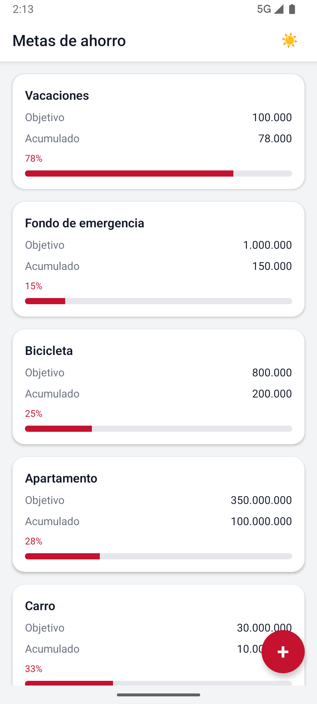
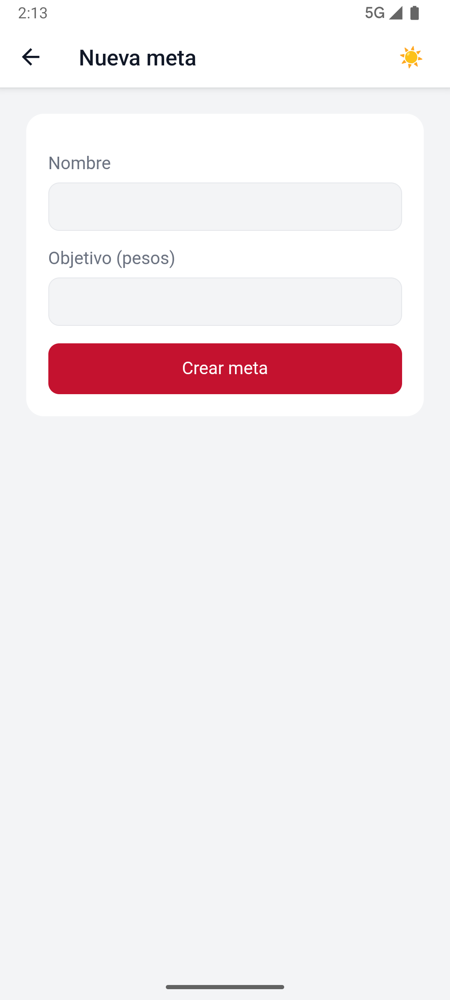
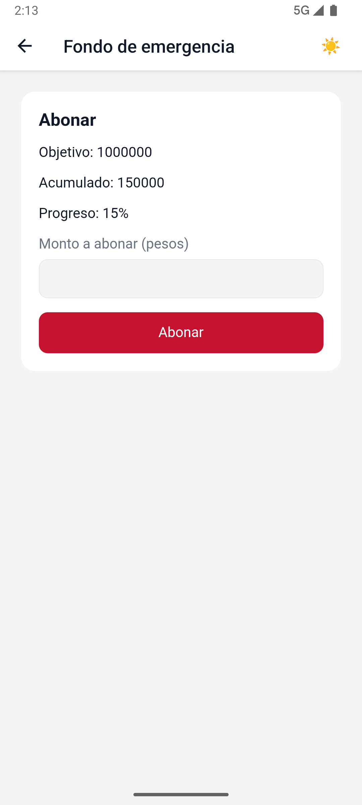

# Savings Goal Wallet

App React Native para **metas de ahorro**: listado nativo, abono en una micro-app web embebida y confirmación nativa al completar el objetivo. Monorepo npm con **Clean Architecture** feature-first, **Container-Presenter**, **DI explícita** (factory + `extraArgument` de Redux Toolkit) y una librería **TurboModule** de primer nivel.


---

## Qué es

Tres paquetes en un repositorio. El host nativo es la fuente de verdad; la web solo pide por `postMessage`; la librería se **crea y se consume** como workspace, no se copia a `mobile/`.

| Workspace | Paquete | Rol |
|-----------|---------|-----|
| `mobile/` | `SavingsGoalWallet` | Host React Native (CLI oficial, sin Expo) |
| `libreria/` | `rn-savings-notifier` | TurboModule: aviso al completar/registrar y diálogo de confirmación |
| `web/` | `web` | Micro-app HTML/JS estática en el WebView (`file://`) |

---

## Vista previa

*Tema claro — flujos principales del host y de la micro-app.*

| Listado | Nueva meta | Abono |
|:-------:|:----------:|:-----:|
|  |  |  |
| Metas, progreso y FAB | Alta en WebView (`create`) | Detalle e importe a abonar |

Apariencia sistema / claro / oscuro en runtime (control en el header nativo).

---

## Destacados

- **Monorepo npm** — un `npm install` enlaza `mobile`, `libreria` y `web`
- **Host CLI** — React Native **0.81.6**, React **19**, Hermes, New Architecture; **sin Expo**
- **Micro-app local** — `web/` en assets Android y bundle iOS; sin servidor ni `fetch`
- **Librería de primer nivel** — TurboModule Kotlin + Objective-C, autolinking, nunca vendored en `mobile/`
- **Arquitectura nombrada** — Clean Architecture feature-first, Container-Presenter, factory DI + RTK `extraArgument`, atomic solo donde hay reutilización
- **Kernel testeable** — dominio, puertos y parser Zod; coverage ≥70%
- **Listado nativo** — HU 1; persistencia AsyncStorage detrás de `GoalsRepository`
- **Detalle/abono** — WebView inmersivo, `postMessage` Zod, listado sin reload (HU 2–3)
- **Confirmación nativa** — HU 4: Toast Android / overlay iOS, no `Alert` de RN
- **Alta y baja** — FAB + `CREATE_REQUESTED`; long-press + diálogo nativo
- **iOS Simulator** — mismo producto que Android
- **OpenSpec** — un change por fase, rama `feat/<change-name>`, PR hacia `main`

---

## Funcionalidades

### Implementado

| Funcionalidad | Estado |
|---------------|--------|
| Workspaces `mobile/`, `libreria/`, `web/` | ✅ |
| Host Android e iOS RN 0.81 + New Architecture + Hermes | ✅ |
| WebView `file://` con HTML de `web/` (no es launch screen) | ✅ |
| Dominio `Money` / `Progress` / `SavingsGoal` + tests | ✅ |
| Puertos `GoalsRepository` / `GoalNotifier` / `ConfirmDialog` | ✅ |
| Use cases `GetGoals`, `MakeDeposit`, `CreateGoal`, `DeleteGoal` | ✅ |
| Catálogo Zod `postMessage` + `parseBridgeMessage` | ✅ |
| Store RTK + `extraArgument` | ✅ |
| Listado nativo HU 1 (nombre / objetivo / acumulado / %) | ✅ |
| WebView inmersivo de detalle/abono (HU 2) | ✅ |
| Abono web → dominio nativo → listado sin recargar (HU 3) | ✅ |
| Toast / overlay nativo al completar o registrar (HU 4) | ✅ |
| Persistencia AsyncStorage (lista vacía no se re-siembra) | ✅ |
| Títulos únicos; apariencia sistema / claro / oscuro | ✅ |
| Alta (FAB) y baja (long-press + confirmación nativa) | ✅ |
| Skills, agent y `docs/ia/USO_IA.md` en `mobile/` y `libreria/` | ✅ |

### Por fase

| Fase | Entrega | Estado |
|------|---------|--------|
| **1** Andamiaje del monorepo | Metro, autolinking, WebView, librería stub | ✅ |
| **2** Dominio y contratos | `SavingsGoal`, Zod `postMessage`, puertos | ✅ |
| **3** HU 1 — listado nativo | RTK + listado | ✅ |
| **4** HU 2–3 — detalle y abono | WebView inmersivo; listado sin recargar | ✅ |
| **5** HU 4 — nativo real | Toast / overlay al 100% | ✅ |
| **6** Persistencia | Adapter `GoalsRepository` (AsyncStorage) | ✅ |
| **7** UI contemporánea | Header único, chrome, apariencia persistida | ✅ |
| **8** Alta y baja de metas | FAB + formulario web; long-press | ✅ |
| **9** Entorno iOS | Simulator, bundle `web/`, TurboModule iOS | ✅ |
| **10** IA gobernada | Skills, agent, `docs/ia/USO_IA.md` | ✅ |
| **11** Documentación de cierre | README de paquetes, coverage, huecos honestos | ✅ |

Historias HU 1–4, diagramas y recortes: [`docs/PLAN_EJECUCION.md`](docs/PLAN_EJECUCION.md).

---

## Stack tecnológico

| Tecnología | Uso |
|------------|-----|
| **React Native 0.81.6** | Host `mobile/` — no usar 0.82+ |
| **React 19.1.4** | UI del host |
| **Community CLI** | `@react-native-community/cli` 20 — sin Expo |
| **TypeScript** | Strict en `mobile/` y `libreria/` |
| **Redux Toolkit** | Fuente de verdad aplicativa (`extraArgument` + slice `goals`) |
| **Zod** | Contrato `postMessage` y snapshots |
| **AsyncStorage** | Persistencia detrás de `GoalsRepository` (CLI, no Expo) |
| **react-native-webview** | Host de la micro-app local |
| **TurboModule** | `rn-savings-notifier` (Kotlin + Objective-C) |
| **Jest + RNTL** | Tests en `mobile/` y `libreria/`; **cero tests en `web/`** |
| **npm workspaces** | `install-strategy=nested` para Metro / autolinking |

---

## Arquitectura

Capas **dentro de cada feature** (`goals`, `goal-detail`, `notifications`), más un kernel en `core/`. Patrones nombrados: **Clean Architecture feature-first**, **Container-Presenter**, **DI explícita** (factory, sin IoC), **DI con Redux** (`extraArgument` + listeners), **TurboModule**, **templates inmersivos**, **atomic pragmático** (`MoneyText`, `ProgressBar`).

```
  Presentation  →  Application  →  Domain
                         │
                         ▼
                  Infrastructure
```

- **Domain:** `SavingsGoal`, `Money`, `Progress` — sin React, RN ni Redux
- **Application:** use cases y puertos (`GoalsRepository`, `GoalNotifier`, `ConfirmDialog`)
- **Infrastructure:** AsyncStorage, adapter `postMessage`, adapter TurboModule, slice RTK
- **Presentation:** Container-Presenter; el detalle/abono vive en `web/`
- **DI:** `createAppDependencies()` inyectada con `thunk.extraArgument`

El dominio vive en nativo: la web emite `DEPOSIT_REQUESTED`; `MakeDeposit` decide.

Detalle: [`docs/architecture.md`](docs/architecture.md) · [`docs/runtime-design.md`](docs/runtime-design.md) · [`docs/PLAN_EJECUCION.md`](docs/PLAN_EJECUCION.md).

---

## Cómo ejecutar

**Requisitos:** Node **20+** · **JDK 17** · Android SDK · **Xcode 16+** (macOS) · emulador Android o **iOS Simulator**.

```bash
git clone https://github.com/Esteban37/savings-goal-wallet.git
cd savings-goal-wallet
npm install
cd mobile/ios && pod install && cd ../..
npm start
```

En otra terminal, Android:

```bash
npm run android
```

o iOS Simulator:

```bash
npm run ios
```

La app abre el **listado nativo** con 3 metas seed si el almacenamiento está vacío. El FAB abre el formulario web de alta; long-press pide confirmación nativa para borrar. Un tap abre el detalle/abono en WebView. Tras matar la app, metas y apariencia se conservan.

Tras cambiar Kotlin/ObjC hay que **rebuild nativo** (`npm run android` o `npm run ios`); Metro solo no basta.

### Tests y coverage

```bash
npm test
npm run test:coverage
```

`npm test` cubre dominio, parser Zod, use cases, slice/selectores, persistencia, apariencia, bridge, adapters, URI del WebView, wrappers de `libreria/` y el listado (RNTL). `npm run test:coverage` aplica el umbral **≥70%** en `mobile/` (core declarado) y en `libreria/` (wrappers JS). No hay suite en `web/`.

Workspaces: `npm run test:coverage -w mobile` · `npm run test:coverage -w libreria`.

---

## Catálogo `postMessage`

Envelope `{ type, payload }`. Validación en nativo con Zod. La web no usa `fetch`.

### Web → nativo

| `type` | `payload` | Cuándo |
|--------|-----------|--------|
| `WEB_READY` | `{ goalId }` | Load de la micro-app |
| `DEPOSIT_REQUESTED` | `{ goalId, amount }` | Usuario confirma abono |
| `CREATE_REQUESTED` | `{ name, targetAmount }` | Usuario confirma el alta |

Se usa `DEPOSIT_REQUESTED` (no “confirmado en web”) porque **el dominio vive en nativo**.

### Nativo → web

| `type` | `payload` | Cuándo |
|--------|-----------|--------|
| `SESSION_BOOTSTRAP` | `{ sessionId, goalId, userInfo, mode, goal? }` | Tras `WEB_READY`; `mode`: `deposit` \| `create` |
| `DEPOSIT_SUCCEEDED` | `{ goalId, depositedAmount, progressPercent, isCompleted }` | Use case OK |
| `DEPOSIT_FAILED` | `{ goalId, reason }` | Monto u otra regla |
| `CREATE_SUCCEEDED` | `{ goal }` | Alta OK |
| `CREATE_FAILED` | `{ reason }` | Nombre u objetivo inválido |

---

## Documentación

| Documento | Contenido |
|-----------|-----------|
| [`docs/PLAN_EJECUCION.md`](docs/PLAN_EJECUCION.md) | Alcance HU 1–4, arquitectura congelada, fases |
| [`docs/architecture.md`](docs/architecture.md) | Capas, features, DI, patrones |
| [`docs/runtime-design.md`](docs/runtime-design.md) | Bridge, store, persistencia, librería en runtime |
| [`docs/testing-strategy.md`](docs/testing-strategy.md) | Tests, coverage, qué no se testea |
| [`docs/ia/USO_IA.md`](docs/ia/USO_IA.md) | SDD, Cursor Grok 4.6, rechazos, agentes por fase |
| [`AGENTS.md`](AGENTS.md) | Guardrails de importación |
| [`openspec/specs/`](openspec/specs/) | Specs vigentes |
| [`mobile/README.md`](mobile/README.md) | Metro, Android, iOS, tests del host |
| [`libreria/README.md`](libreria/README.md) | Install, autolinking, API TurboModule |
| [`openspec/changes/archive/`](openspec/changes/archive/) | Changes archivados (Fases 1–11) |
| [`openspec/changes/archive/2026-08-21-fase-10-ia-docs-cierre/`](openspec/changes/archive/2026-08-21-fase-10-ia-docs-cierre/) | Change archivado de Fases 10–11 |

---

## Uso de IA

> **Enfoque:** desarrollo **spec-driven** con **OpenSpec**. El autor definió Clean Architecture feature-first, Container-Presenter, DI explícita + Redux `extraArgument`, TurboModule y el alcance por fase. La IA **acelera** implementación y docs **dentro de ese contrato**. Herramienta: **Cursor** con **Cursor Grok 4.6**; el effort varía por fase; **un agente independiente por fase**.

Detalle (prompts, skills, tabla de fases, **qué se rechazó**): **[`docs/ia/USO_IA.md`](docs/ia/USO_IA.md)**.

| Responsabilidad | Autor | IA |
|-----------------|-------|-----|
| Arquitectura, patrones y recortes | ✅ | Sugerencias acotadas |
| Merge a `main` | ✅ | — |
| Rechazar o corregir output | ✅ | — |
| Código/tests/docs desde specs | — | ✅ |

---

## Huecos honestos

| Hoy | Si hiciera falta |
|-----|------------------|
| No hay **editar meta** | Mismo WebView + tipo `UPDATE_REQUESTED` y use case; el puerto ya persiste |
| **App Store / TestFlight / dispositivo físico** no son criterio de merge | Firma, perfil y `run-ios --device`; el Simulator ya cubre el producto |
| **`web/` sin tests** | El handshake se cubre en el host; una suite web sería opt-in y no sustituye Zod en nativo |
| **Toast/overlay sin tests instrumentados** | La demo en emulador/Simulator basta; los wrappers JS de `libreria/` sí se testean |

Fuera de alcance: backend, auth, PII, Expo.

---

## Git workflow

`main` es la rama de integración. Cada change de OpenSpec vive en `feat/<change-name>` y entra con pull request.

1. Actualizar `main` desde `origin/main`.
2. Crear `feat/<change-name>` desde `main`.
3. Commits convencionales (`feat`, `fix`, `test`, `docs`, `chore`) y push en esa rama.
4. Abrir un PR hacia `main` y mergearlo ahí.

---

## Autor

**Esteban Serrano** — Senior Mobile Software Engineer
